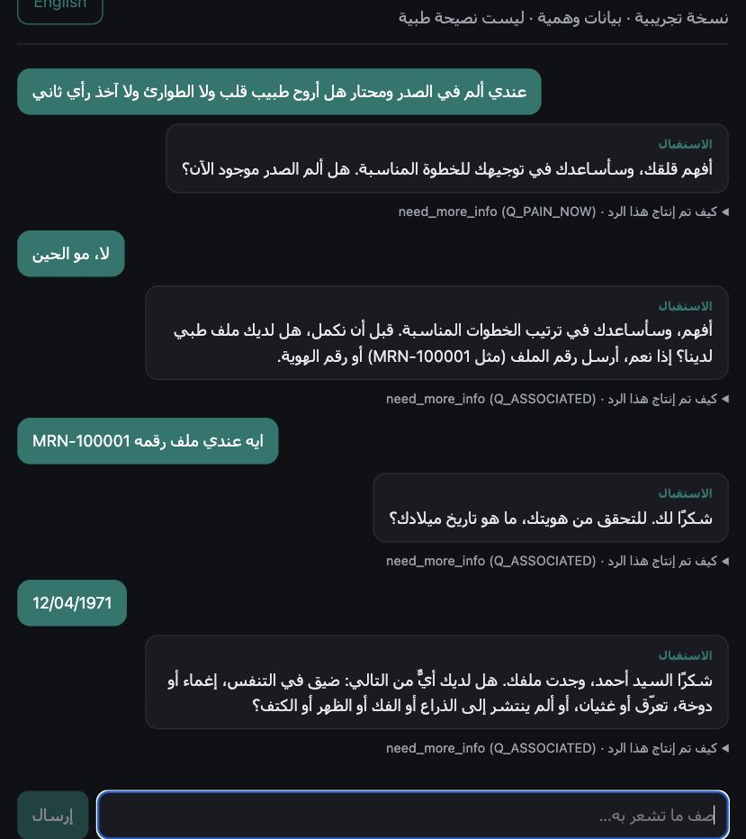
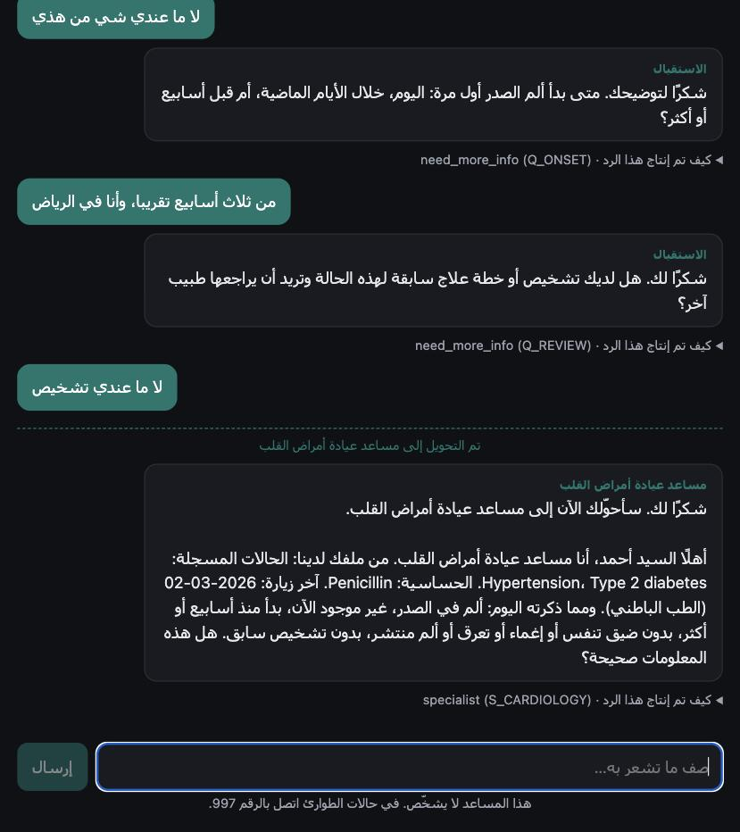
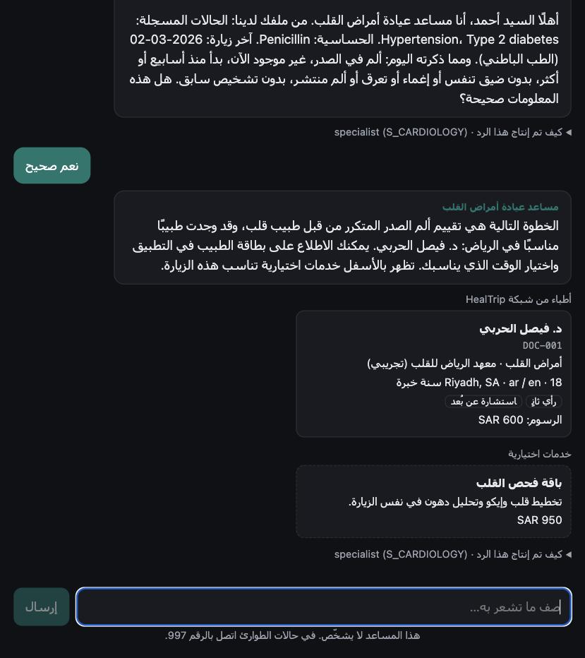
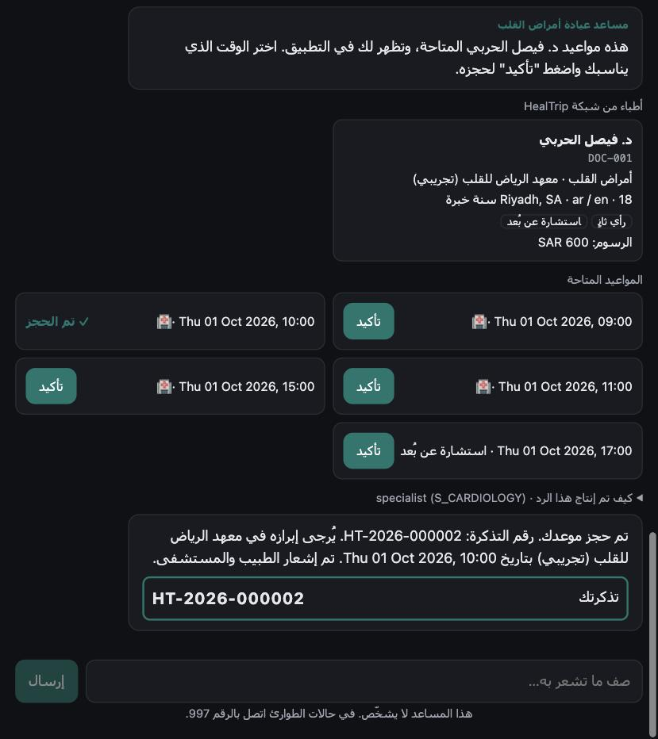
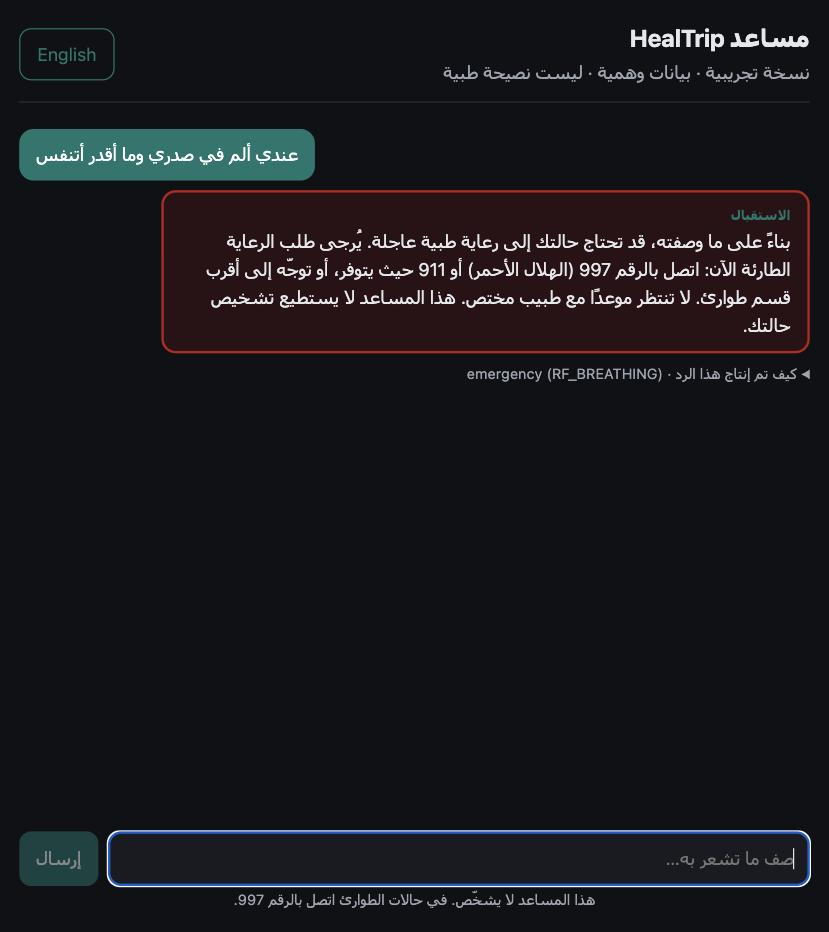

<div dir="rtl">

# HealTrip — مساعد قرار المريض بالذكاء الاصطناعي (نموذج أولي)

**[English version ← README.md](README.md)**

## 🔗 العرض الحي: **https://healtrip-demo.vercel.app**

جرّب: *"عندي ألم في الصدر ومحتار هل أروح طبيب قلب ولا الطوارئ ولا آخذ رأي ثاني"*. عندما يسأل الاستقبال عن الملف، استخدم ملف المريض الخيالي **`MRN-100001`** وتاريخ الميلاد **12/04/1971**، أو قل إنه ليس لديك ملف. زر اللغة في الأعلى.

> ⚠️ نموذج أولي. بيانات وهمية فقط (كل الأطباء والمستشفيات والمرضى خياليون). ليس نصيحة طبية، ولا نظام تشخيص، ولا يدّعي أي توافق تنظيمي.

---

## ماذا يفعل

يصف المريض مشكلته بالعربية أو الإنجليزية، والمساعد:

1. **يفحص الطوارئ أولًا.** قواعد العلامات الحمراء تعمل بالكود على كل رسالة، قبل الذكاء الاصطناعي.
2. **يسأل فقط الأسئلة التي تغيّر القرار**، مثل استقبال المستشفى: يبحث عن ملف المريض (رقم الملف مع تاريخ الميلاد) ثم يفرز الحالة.
3. **يحدد مسار الرعاية بالكود** وليس بالنموذج اللغوي: طوارئ · عاجل · مختص · رأي ثانٍ · رعاية أولية.
4. **يحوّل المريض إلى مساعد العيادة**، الذي يعيد عليه ملخصًا من ملفه ويطلب منه التأكيد.
5. **يبحث في قاعدة بيانات مقدمي الخدمة عبر الأدوات**، ويعرض خيارات حقيقية (وخدمات اختيارية)، ويحجز موعدًا حقيقيًا عند تأكيد المريض، ويصدر **رقم تذكرة تولّده قاعدة البيانات**.

**يوجّه ولا يشخّص.** المبدأ في سطر واحد:

> **النموذج اللغوي يفهم ويتحدث. الكود يقرر ما هو آمن. قاعدة البيانات تقرر ما هو صحيح.**

---

## كيف نمنع الذكاء الاصطناعي من اختلاق المعلومات

الذكاء الاصطناعي يتحدث فقط عمّا **أرجعته قاعدة البيانات في هذه المحادثة**. البيانات وهمية، لكنها المصدر الوحيد للحقيقة: السؤال هو *"هل جاء من قاعدة بياناتنا؟"*، فالأطباء الوهميون يمرّون، وأي شيء يخترعه النموذج يُمنع. والمنع بالكود وليس بالتعليمات:

1. **لا مصدر إلا الأدوات:** الأطباء والمستشفيات والمواعيد تأتي فقط من استعلامات قاعدة البيانات.
2. **الكود يملك القرار الطبي:** النموذج لا يستطيع تغيير التخصص الذي يبحث عنه.
3. **المعرّفات فقط:** النموذج يكتب `[DOC-001]`، والواجهة تعرض الاسم من بطاقة قاعدة البيانات.
4. **كل رد يُفحص:** أي معرّف غير معروف، أو اسم طبيب أو مستشفى يكتبه النموذج، أو تشخيص، أو طمأنة كاذبة، أو "تم الحجز" ← يُستبدل الرد بنص ثابت مبني من قاعدة البيانات.
5. **المعلومات المهمة لا تُولَّد أبدًا:** رقم التذكرة والمواعيد وملخص الملف ورسائل الطوارئ من قاعدة البيانات أو قوالب ثابتة.

مثال حي: *"أبغى الدكتور خالد العمري في مستشفى الحبيب، هل هو متاح؟"* ← *"أستطيع الحجز فقط مع أطباء شبكة HealTrip، ولم أجد هذا الطبيب أو المستشفى فيها."* مع الخيارات الحقيقية من قاعدة البيانات. لكل قاعدة اختبار، والاختبارات تفشل عند تعطيل الحماية. **التفاصيل (بالإنجليزية): [docs/SAFETY.md](docs/SAFETY.md).**

---

## سير العمل

| | |
|---|---|
| **1 · السلامة أولًا ثم الاستقبال.** سؤال "هل الألم موجود الآن؟" يأتي *قبل* رقم الملف، والملف لا يُفتح إلا إذا تطابق رقمه مع تاريخ الميلاد. |  |
| **2 · التحويل إلى مساعد العيادة.** القواعد اختارت أمراض القلب. الملخص قالب من قاعدة البيانات، ولا يعيد النموذج صياغته. لا يُعرض شيء قبل تأكيد المريض. |  |
| **3 · أطباء من قاعدة البيانات وخدمات اختيارية.** البطاقات صفوف من قاعدة البيانات، والعروض تظهر فقط بعد التأكيد ولا تظهر أبدًا في الطوارئ. |  |
| **4 · المريض يؤكد ← تذكرة من قاعدة البيانات.** النموذج لا يملك أداة حجز، ويتم إشعار الطبيب ونظام المستشفى (تجريبي، بصيغة FHIR). |  |
| **5 · الطوارئ.** علامة خطر في كلام المريض ← رسالة ثابتة مع 997/911، والنموذج لا يُستدعى أصلًا. |  |

---

## البنية

</div>

```
Next.js chat UI (AR/EN)  ──/api proxy──▶  FastAPI backend                                   ──▶  PostgreSQL
renders only backend data                 ① red-flag check (code)                                (source of truth)
                                          ② LLM: extract structured facts (forced tool call)
                                          ③ triage rules (code) → care path + next question
                                          ④ tool gateway → search_providers / get_* / slots
                                          ⑤ output checks: grounding + no-diagnosis
                                          booking (DB transaction) · notification outbox
```

<div dir="rtl">

| الطبقة | الاختيار | السبب |
|---|---|---|
| الواجهة | Next.js + TypeScript | محادثة بسيطة، ودعم الاتجاهين |
| الخادم | FastAPI + Pydantic | عقود مكتوبة ومتحقق منها (نفس دور Zod في Node)، وتوثيق OpenAPI تلقائي |
| قاعدة البيانات | PostgreSQL | بيانات علائقية، وقيود على مستوى القاعدة، ومعاملات للحجز |
| الذكاء الاصطناعي | وكيل واحد بصيغة OpenAI المتوافقة (DeepSeek في العرض) | تغيير المزوّد مجرد إعداد |

**الأدوات** (يتم التحقق منها، وتُمنح حسب مسار الرعاية): `search_providers` (التخصص تحدده القواعد وليس النموذج) · `get_doctor_details` و`get_available_slots` (فقط لأطباء أُرجعوا في المحادثة) · `get_hospital_details`.

**قاعدة البيانات:** `specialties` · `hospitals` · `doctors` · `slots` · `patients` (ملف CRM وهمي) · `offers` · `bookings` (تذكرة من قاعدة البيانات) · `notifications` · `chat_sessions`.
**الـAPI:** `POST /api/v1/chat` · `POST /api/v1/bookings` · `POST /api/v1/triage` (قواعد فقط) · `GET /api/v1/doctors|hospitals|specialties`.
**الهيكل الكامل والـAPI ومسار البيانات والحجز وتصميم الإنتاج (بالإنجليزية): [docs/ARCHITECTURE.md](docs/ARCHITECTURE.md).**

---

## الأمان ومعالجة الأخطاء (باختصار)

- تحقق من المدخلات على كل الحدود، واستعلامات بمعاملات مربوطة فقط، والأسرار في متغيرات البيئة، ومفتاح الذكاء الاصطناعي لا يصل للمتصفح أبدًا.
- الهوية: رقم الملف مع تاريخ الميلاد، ورسالة فشل موحّدة، وحد 3 محاولات، وحذف المعرّفات بعد التحقق.
- لا تاريخ مرضي ولا أعراض في الإشعارات أو السجلات، والمحادثات تنتهي بعد 30 دقيقة، وحد استخدام يومي للعرض العام.
- تعطل الذكاء الاصطناعي ← رسالة واضحة (وفحص الطوارئ يستمر) · تعطل قاعدة البيانات ← "لا أستطيع الوصول" دون اختلاق · لا نتائج ← يُقال بوضوح · طوارئ ← يتوقف البحث.
- قبل الإنتاج: مصادقة وموافقة، وتشفير، وسجل تدقيق، ومراجعة PDPL والأمن السيبراني، و**تقييم من هيئة الغذاء والدواء** (برمجيات دعم القرار الطبي قد تُعتبر جهازًا طبيًا)، وقواعد معتمدة من أطباء.

## الافتراضات

- لم تُقدَّم بيانات أو قواعد سريرية حقيقية من HealTrip، لذا كل البيانات خيالية.
- قواعد الفرز محافظة وكتبها مهندس (باتجاه إرشادات AHA/ACC 2021: ألم الصدر الحاد حالة طارئة)، وليست إرشادًا طبيًا.
- أرقام الطوارئ سعودية (997 / 911)، و"الرأي الثاني" يعني تشخيصًا سابقًا للمراجعة.
- الاستقبال والحجز والعروض مصغّرة عمدًا، وكل منها يوضح قرارًا هندسيًا واحدًا.

**ماذا كشف الاختبار الحي وكيف أُصلح، والتكلفة والاستضافة (بالإنجليزية): [docs/ENGINEERING_NOTES.md](docs/ENGINEERING_NOTES.md).**

</div>
