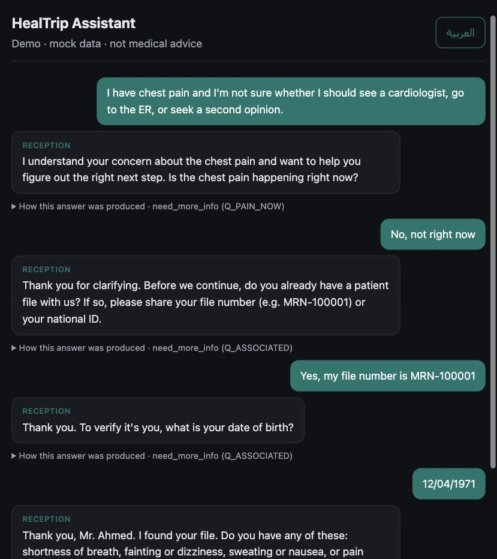
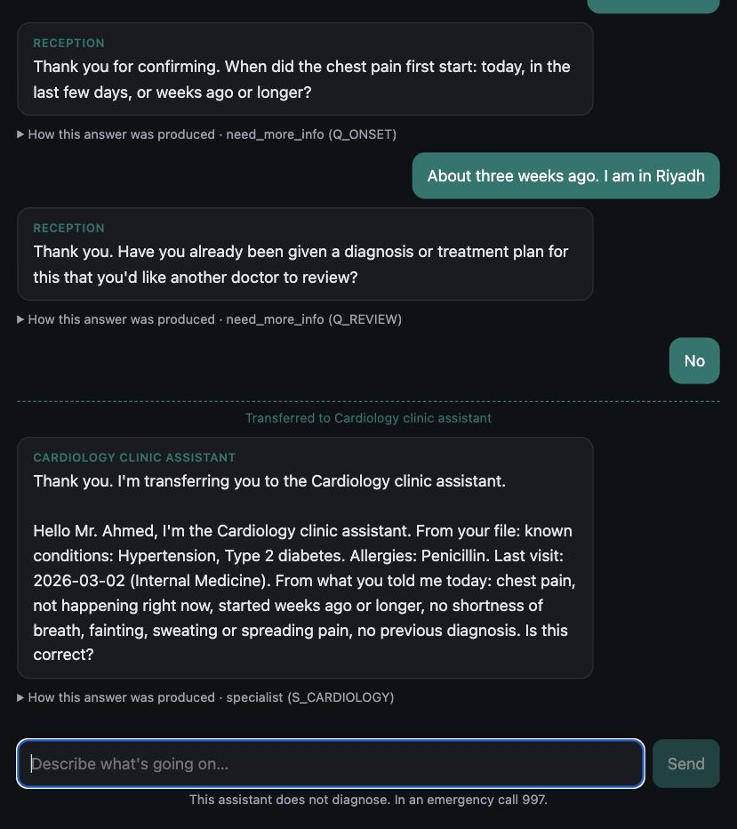
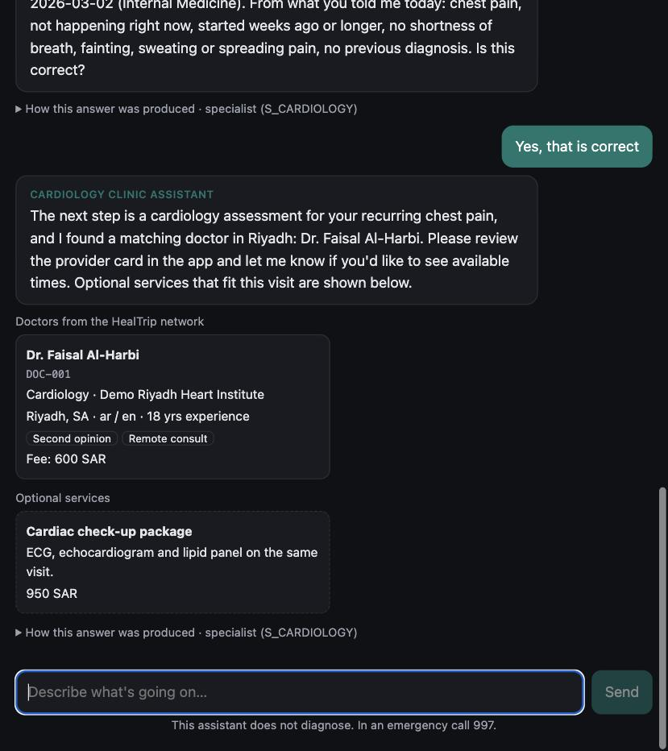
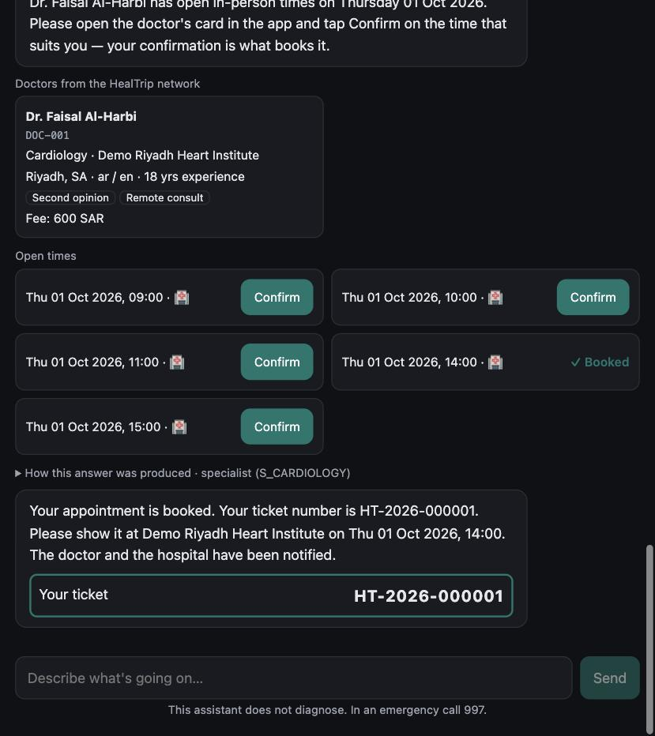
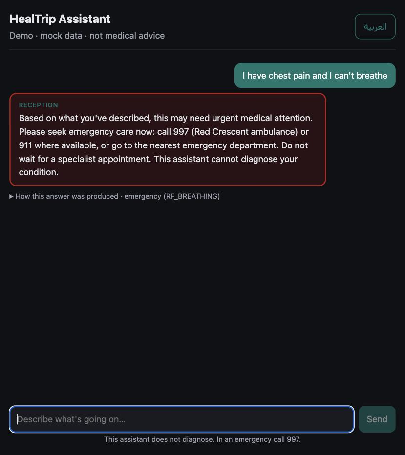

# HealTrip — AI Patient Decision Assistant (Prototype)

**[النسخة العربية ← README.ar.md](README.ar.md)**

## 🔗 Live demo: **https://healtrip-demo.vercel.app**

Try: *"I have chest pain and I'm not sure whether I should see a cardiologist, go to the ER, or seek a second opinion."* When asked for a file, use the fictional patient **`MRN-100001`**, born **12/04/1971**, or say you have none. Arabic: button top-right.

> ⚠️ Prototype. Mock data only (every doctor, hospital and patient is fictional). Not medical advice, not a diagnostic system, no regulatory compliance claimed.

---

## What it does

A patient describes a problem in Arabic or English. The assistant:

1. **Checks for emergencies first.** Red-flag rules run in code on every message, before the AI.
2. **Asks only the questions that can change the decision**, like a hospital reception: finds the patient's file (file number + date of birth), then triages.
3. **Decides the care path in code**, not by the LLM: emergency · urgent · specialist · second opinion · primary care.
4. **Hands off to the clinic assistant**, which reads back a summary from the file and asks the patient to confirm.
5. **Searches the provider database with tools**, shows real options (plus optional services), books a real slot on the patient's confirmation, and issues a **ticket number generated by the database**.

**It routes; it never diagnoses.** The one-line design principle:

> **The LLM understands and talks. Code decides what is safe. The database decides what is true.**

---

## How the AI is stopped from inventing information

The AI may only talk about what **the database returned in this conversation**. The data is mock data, but it's the source of truth: the check is *"did this come from our database?"*, so mock doctors pass and anything the model makes up is blocked. It's enforced in code, not by prompt:

1. **No knowledge path except tools.** Doctors, hospitals and times come only from DB queries.
2. **Code owns the clinical choice.** The model can't change the specialty it searches for.
3. **IDs only.** The model writes `[DOC-001]`; the UI shows the name from the DB card.
4. **Every reply is checked.** Unknown IDs, any doctor/hospital *name* written by the model (EN + AR), diagnoses, false reassurance or "you're booked" → the reply is replaced with fixed text built from DB data.
5. **Critical facts are never generated.** Ticket numbers, slots, file summaries and emergency messages come from the DB or fixed templates.

Live example: *"Can I book with Dr. Ahmed Al-Zahrani at King Faisal Specialist Hospital?"* → *"I can only book doctors in the HealTrip network, and I couldn't find that doctor or hospital in it."* + the real DB options. Every rule has a test, and the tests fail when the guard is switched off. **Details: [docs/SAFETY.md](docs/SAFETY.md).**

---

## The workflow

| | |
|---|---|
| **1 · Safety first, then reception.** "Is the pain happening now?" comes *before* the file number. The file is found only when file number + date of birth match. |  |
| **2 · Handoff to the clinic assistant.** The rules picked Cardiology. The summary is a DB template, never paraphrased by the LLM. Nothing is offered until the patient confirms. |  |
| **3 · Doctors from the DB + optional services.** Cards are DB rows; offers appear only after confirmation and never on emergency paths. |  |
| **4 · Patient confirms → ticket from the DB.** The model has no booking tool. The doctor and hospital system are notified (mocked, FHIR `Appointment`). |  |
| **5 · Emergency.** A red flag in the patient's words → fixed message with 997/911. The LLM is never called. |  |

---

## Architecture

```
Next.js chat UI (AR/EN)  ──/api proxy──▶  FastAPI backend                                   ──▶  PostgreSQL
renders only backend data                 ① red-flag check (code)                                (source of truth)
                                          ② LLM: extract structured facts (forced tool call)
                                          ③ triage rules (code) → care path + next question
                                          ④ tool gateway → search_providers / get_* / slots
                                          ⑤ output checks: grounding + no-diagnosis
                                          booking (DB transaction) · notification outbox
```

| Layer | Choice | Why |
|---|---|---|
| UI | Next.js + TypeScript | Simple chat, RTL/LTR |
| Backend | FastAPI + Pydantic | Typed, validated contracts (the role Zod plays in Node), auto OpenAPI docs, strong LLM tooling |
| DB | PostgreSQL | Relational provider data, DB-level constraints, transactions for booking |
| AI | One agent, OpenAI-compatible API (DeepSeek in the demo) | Provider is a config change; one orchestrator is enough at this scope |

**Tools the agent can call** (validated, and authorised per care path by the gateway):

| Tool | Allowed when |
|---|---|
| `search_providers(city?, country?, language?, remote?)` | specialist / second opinion / primary care. Specialty is set by the rules, not the model. |
| `get_doctor_details(doctor_id)` · `get_available_slots(doctor_id)` | only doctors returned earlier in this conversation |
| `get_hospital_details(hospital_id)` | only hospitals of those doctors |

**Database:** `specialties` · `hospitals` · `doctors` · `slots` · `patients` (mock CRM file) · `offers` · `bookings` (DB-generated ticket) · `notifications` (outbox) · `chat_sessions`.
**API:** `POST /api/v1/chat` · `POST /api/v1/bookings` · `POST /api/v1/triage` (rules only, no LLM) · `GET /api/v1/doctors|hospitals|specialties` · OpenAPI at `/docs`.
**Full schema, API table, data flow, booking and production design: [docs/ARCHITECTURE.md](docs/ARCHITECTURE.md).**

---

## Security & error handling (short)

- Validation at every boundary; bound SQL parameters only; secrets in env vars; the AI key never reaches the browser; CORS allow-list.
- Identity: file number + date of birth, identical failure message, 3-attempt cap. File/ID numbers are pulled out **in code** and never sent to the LLM or kept in the chat history; the date-of-birth answer is erased after the check.
- No patient history or symptoms in notifications or logs; conversation text is kept in the DB for at most 30 minutes; daily usage cap on the public demo.
- AI down → clear message · DB down → "can't access the provider database" (nothing fabricated) · no match → said plainly · **emergency → the fixed emergency message is returned even if the AI, the database or the daily cap fails.**
- Production still needs: auth + consent, encryption at rest, audit logs, PDPL/NCA review, an **SFDA** assessment (clinical decision software can be a medical device), and clinician-validated rules. **Details: [docs/SAFETY.md](docs/SAFETY.md).**

## Assumptions

- No real HealTrip data or clinical rules were provided, so all providers, prices, slots and patients are fictional.
- Triage rules are conservative prototype rules written by an engineer (following the 2021 AHA/ACC direction that acute chest pain is an emergency), not clinical guidance.
- Saudi emergency numbers (997 / 911); a "second opinion" means an existing diagnosis to review.
- Reception, booking and offers are deliberately thin. Each exists to show one engineering decision.

**What live testing found and how each issue was fixed, cost, hosting: [docs/ENGINEERING_NOTES.md](docs/ENGINEERING_NOTES.md).**

---

## Run it locally

```bash
docker compose up -d                                  # Postgres on :5433
cd backend && python3.12 -m venv .venv && .venv/bin/pip install -r requirements.txt
cp .env.example .env                                  # set LLM_BASE_URL / LLM_MODEL / LLM_API_KEY
.venv/bin/python -m app.seed --reset && .venv/bin/uvicorn app.main:app --port 8000
.venv/bin/python -m pytest -q                         # 95 tests (real Postgres, scripted fake LLM)
cd ../frontend && npm install && npm run build && npx next start -p 3100
```
